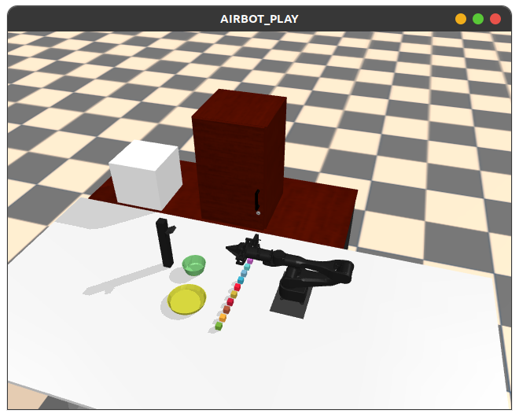
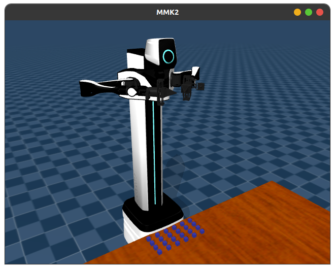

# DLABSIM

## Install

```bash
cd DLabSim
pip install -r requirements.txt
pip install -e .
### If there is a network problem:
# pip install -r requirements.txt -i https://pypi.tuna.tsinghua.edu.cn/simple
# pip install -e . -i https://pypi.tuna.tsinghua.edu.cn/simple
```

## Test

```bash
cd DLabSim/dlabsim/envs
python airbot_play_il.py
```

### Usage
- Press 'h' to print help
- Press 'q' to quit the program
- Press 'r' to reset the state
- Press '[' or ']' to switch camera view
- Press 'Esc' to set free camera
- Press 'p' to print the rotot state




## Tools

-   `convex decomposition`
-   `urdf format`
-   `3DGS .ply converter`
-   `3DGS .ply transposer`
-   [`obj2mjcf`](https://github.com/kevinzakka/obj2mjcf)